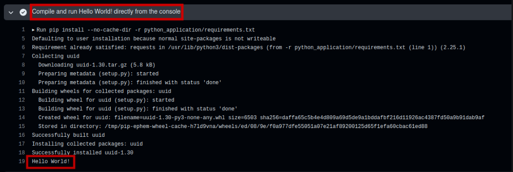

# Welcome to Andre-Devsecops
This is a guide to help you navigate this repository.

## Github Pipeline status

## Folder Structure
- `.github`: main GitHub Actions directory
- `.github/workflow/ci.yml`: GitHub Actions CI/CD configuration
- `python_application`: Python application, Python dependencies, and Dockerfile directory
- `assets`: Directory for screenshots

## Workflow flow
1.Running application directly from console
- checkout code
- compile dependency and run hello world
Result: 
- upload hello world python and dockerfile files as artifact

2. Running application from docker
- login into docker hub
- download artifact for hello world python and dockerfile files from first workflow
- build and push docker image into docker hub
- run image vulnerability scanner for image result using trivy
- running hello world from docker
Result: 

## Additional Information
Hub Docker URL: https://hub.docker.com/repository/docker/iilness/andre-devsecops-python/general

## Contact
Linkedin Link: https://www.linkedin.com/in/iilness/
